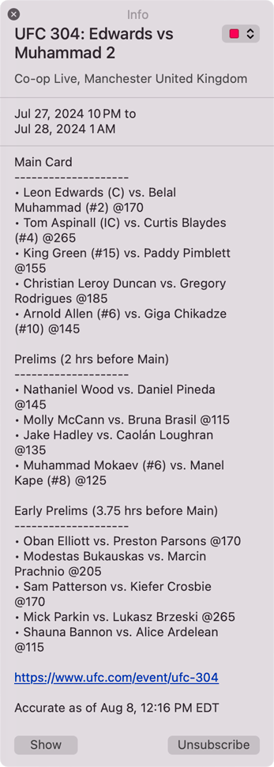

# ufc-cal

[Subscribe to this calendar to keep track of UFC events](https://clarencechaan.github.io/ufc-cal/)

Or subscribe manually from your calendar app:

`webcal://raw.githubusercontent.com/clarencechaan/ufc-cal/ics/UFC.ics`

## What is this?

A calendar feed that automatically adds UFC events to your calendar app of choice as each event gets announced and updated over time.

This feed is not affiliated with the UFC.

## Why is it better than other feeds?

The three biggest points that this aims to address, which I found lacking in other calendar feeds:

- **Always kept up to date**: events are added and card details are updated within a day of the UFC posting an event or adding/removing fights to/from a previously announced event
- **Event times are accurate**: event times reflect your local timezone, and always match the times posted by the UFC
- **Card details**: without leaving your calendar, you can see every (announced) fight on the card, whether it's on the main card, prelims, or early prelims

## Example event

## Info for nerds

**How does it work?**

- Using a GitHub Action, the UFC's website is scraped several times each day, and the `UFC.ics` file (from the URL above) is updated with any new information found
  
**To run locally:**

- Clone this repo, run the command `npm start`, and out spits your `UFC.ics` file with all the relevant UFC events
